# electrocasa-lakehouse
---

## 1. Objetivo

ElectroCasa cuenta con diferentes fuentes de información relacionadas con ventas, productos, empleados, reseñas, devoluciones y seguimiento de envíos.

El objetivo del proyecto es centralizar estas fuentes en Azure Databricks para obtener una plataforma de datos que permita responder preguntas como:

- ¿Cuánto vendió cada sucursal por mes?
- ¿Cuál es el ticket promedio por sucursal?
- ¿Qué productos tienen mayor cantidad de ventas?
- ¿Qué productos presentan más devoluciones?
- ¿Cuántos empleados activos tiene cada sucursal?
- ¿Qué categorías presentan mayor proporción de reseñas negativas?

---

# 2. Arquitectura

```text
                         FUENTES
                            │
        ┌───────────────────┼────────────────────┐
        │                   │                    │
        ▼                   ▼                    ▼
   Archivos CSV/JSON    Catálogo JSON       Azure SQL
        │                   │                    │
        │                   │                    │
        ▼                   ▼                    ▼
   Volume Landing       COPY INTO         Lakehouse Federation
        │                   │                    │
        └───────────────────┼────────────────────┘
                            ▼
                         BRONZE
                            │
                            ▼
                         SILVER
                            │
                  ┌─────────┼─────────┐
                  │         │         │
                  ▼         ▼         ▼
              Limpieza  Calidad  Historificación
                  │
                  ▼
                          GOLD
                            │
          ┌─────────────────┼─────────────────┐
          │                 │                 │
          ▼                 ▼                 ▼
       Ventas          Productos          Empleados
       por mes        y devoluciones       activos
                            │
                            ▼
                      Reseñas negativas
                        por categoría

```

# 3. Fuentes de datos
El proyecto integra seis fuentes:

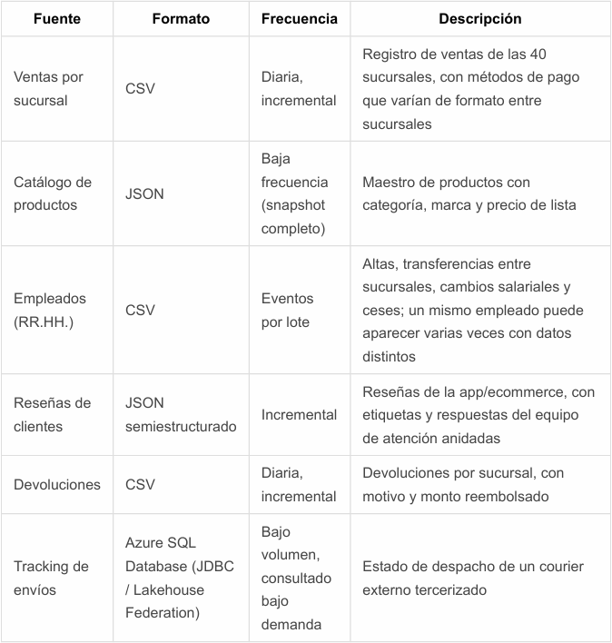

# 4. Unity Catalog
El proyecto utiliza un catalogo propio llamado "electrocasa" junto a 3 schemas correspondientes al modelo Medallion

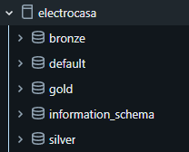

# 5. Landing zone
Se utiliza un Volume de Unity catalog y cuenta con una estructura de carpetas

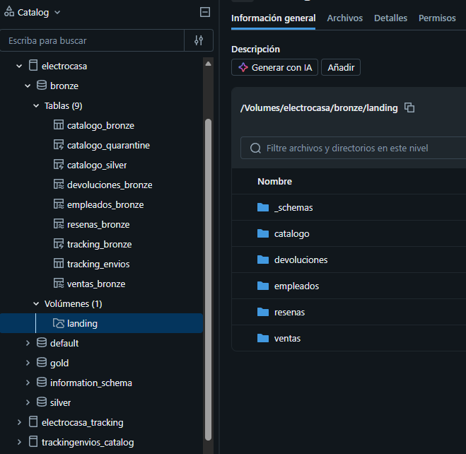

# 6. Capa Bronze
La capa Bronze conserva los datos de origen y agrega columnas técnicas de auditoría.

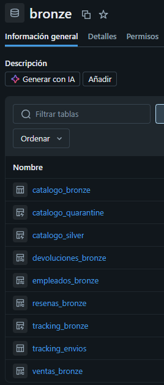

# 7. Capa silver
La capa Silver realiza:
- limpieza
- estandarización
- deduplicación
- conversión de tipos
- validaciones de calidad
- historización de empleados
  
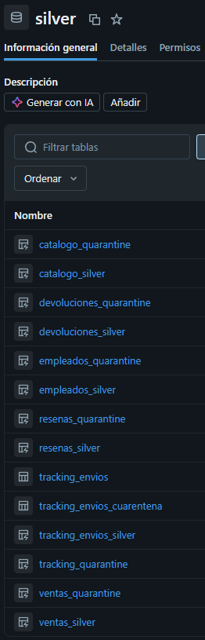

# 8. Capa Gold
Contiene información preparada para análisis de negocio.

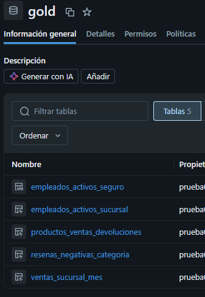

# 9. Tracking de envíos
El Tracking se obtiene desde Azure SQL Database mediante Lakehouse Federation.

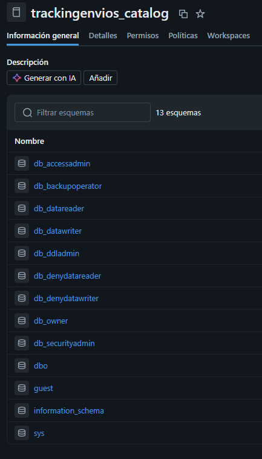

# 10. Pipeline
El pipeline "electrocasa Pipeline" esta implementado mediante LakeFlow Declarative Pipelines y contiene las transformaciones

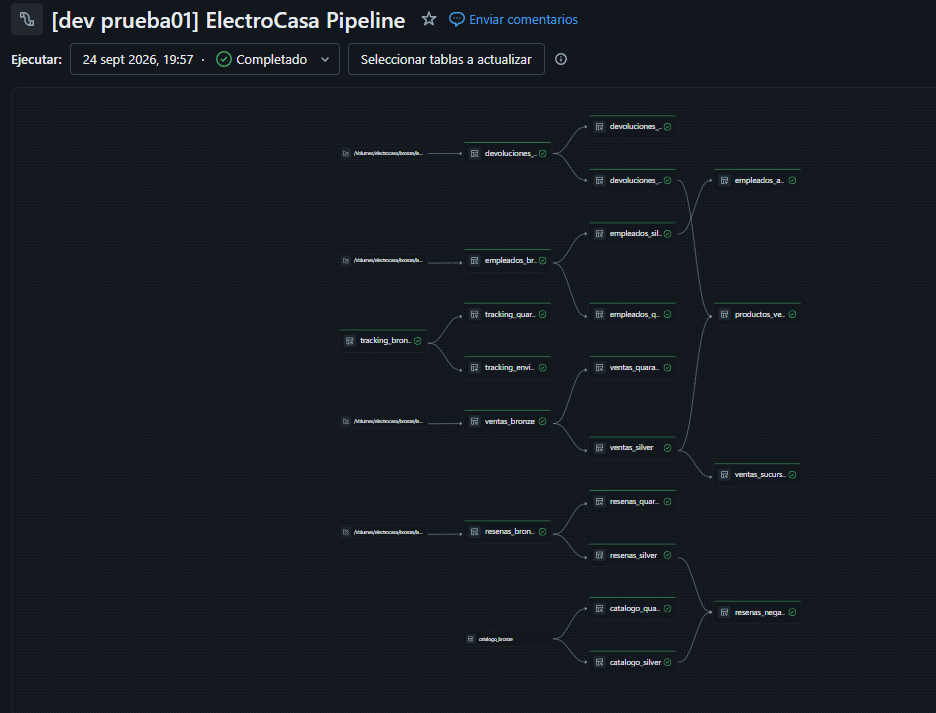

# 11. Jobs
Rl Job "electrocasa Job" 
La dependencia entre tareas es: ingest_catalogo ---> electrocasa pipeline

Se utiliza 2 tipos de tareas:
- SQL Task
- Pipeline task

Esto permite ejecutar primero la carga del catalogo y posteriormente actualizar el pipeline de datos

# 12. Estructura del proyecto

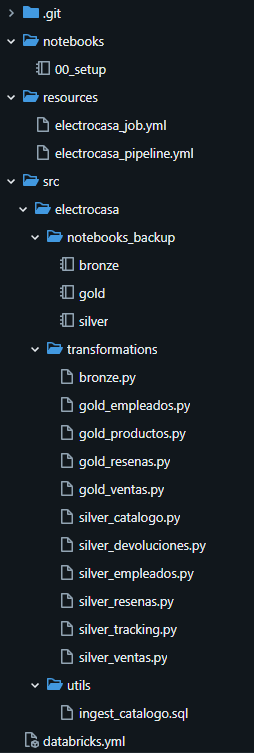

# 13. Reintentos, Alertas y Programacion
Dentro de los archivos yml esta configurado:
max_retries: 2
min_retry_interval_millis: 60000

email_notifications:
  on_failure:
    - LZ4lv4roJoaqu1n@outlook.com

Ademas de la programacion para su ejecucion diaria:
08:00 AM
America/Lima
UTC-05:00

Dicha configuracion se puede visualizar en> resources/electrocasa_job.yml

# 14. Permisos
Se definieron 3 grupos:
- Ingenieria
- Analistas
- Auditoria

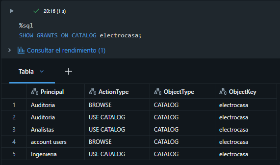
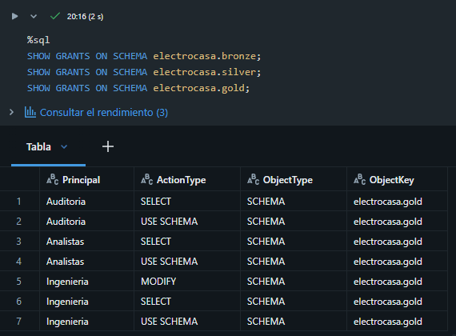

# 15. Monitoreo
Las ejecuciones del Job pueden revisarse desde: Jobs y canales>[dev prueba01] ElectroCasa Job

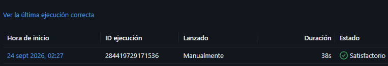

# 16. Consumo y costos
Se utilizo la tabla system.billing.usage para revisar el consumo del entorno, en el que se observo los siguientes consumos:

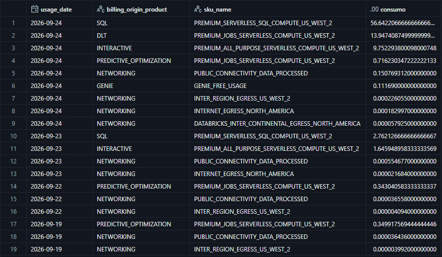
